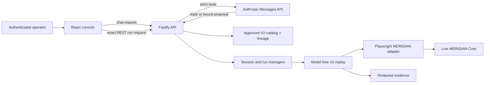

# MERIDIAN Capability Console

This repository adapts the discover-once, deterministic-replay core to the live [MERIDIAN Core sample](https://web-sample.interface-hiring.com/). It delivers all eight required V2 capabilities as a typed API, an Anthropic-driven assistant that launches the approved API operations, and a React dashboard for sessions, runs, approvals, handoff, reconciliation, and evidence.

Anthropic is the only model provider. It is used for intent routing and discovery; it never receives MERIDIAN credentials, issues approval authority, or participates in deterministic replay. The production application loads only immutable V2 artifacts whose approved discovery lineage matches their canonical SHA-256 digest.

## Delivered capability surface

| Capability ID | Role/effect | Typed result or boundary |
| --- | --- | --- |
| `session.sign_on` | Teller or supervisor authentication | Establishes a server-owned, memory-only MERIDIAN browser session. |
| `member.search_by_number` | Read | Returns exact structured member matches. |
| `member.search_by_last_name` | Read | Returns a collection and preserves multiple-match semantics. |
| `member.get_record_and_balances` | Read | Returns member details and typed share/balance/status rows. |
| `funds.transfer` | Irreversible write | Reviews member, shares, amount, and memo before one final post. |
| `share.open` | Irreversible write | Reviews share type and initial deposit before one final post. |
| `member.update_information` | Write | Reviews email, phone, and address before one save. |
| `account.place_hold` | Supervisor-only write | Requires supervisor identity, same-session handoff when needed, review, and one final post. |

The submitted catalog contains all eight artifacts at `2.0.0` plus separate approved lineage records. Exact route/origin policy, typed inputs and outputs, semantic targets, runtime-state handling, write effects, approval requirements, and final checkpoints are part of each artifact rather than hidden in the UI wrapper.

## Architecture and trust boundaries



The boundaries are intentionally small:

- The model sees redacted chat text and strict, secret-free capability schemas, or privacy-safe discovery observations.
- The browser session, MERIDIAN credentials and cookies, hidden transaction tokens, console identity, idempotency bindings, and approval tokens remain server-side.
- Replay consumes an approved artifact and typed inputs with `plannerCallsAllowed: false`; no model is in its decision loop.
- The React client and API bind every run to capability ID, version, artifact digest, target-profile digest, authenticated owner, and server-owned target session.

## Quick start

### Prerequisites

- Node.js `>=22.12 <27`
- npm
- Chromium installed through Playwright
- Access to `https://web-sample.interface-hiring.com`
- An Anthropic API key

Install the exact dependency set and browser:

```powershell
npm.cmd ci
npm.cmd run browser:install
```

Create the local configuration file only if it does not already exist, then open that private file for editing:

```powershell
if (-not (Test-Path -LiteralPath ".\.env")) {
  Copy-Item -LiteralPath ".\.env.example" -Destination ".\.env"
}
notepad.exe ".\.env"
```

Do not paste a key into `.env.example`, chat, a command line, or a screenshot. In Notepad, replace only the value after `ANTHROPIC_API_KEY=` with the rotated key, save the file, and close it. Keep `.env` untracked. Fill at least these entries:

```dotenv
ANTHROPIC_API_KEY=<your Anthropic API key>

MERIDIAN_CONSOLE_TELLER_ACCESS_CODE=<distinct random value, 16+ characters>
MERIDIAN_CONSOLE_SUPERVISOR_ACCESS_CODE=<different random value, 16+ characters>

# Public operators for the hosted sample only
MERIDIAN_TELLER_OPERATOR=teller1
MERIDIAN_TELLER_PASSWORD=password
MERIDIAN_SUPERVISOR_OPERATOR=super1
MERIDIAN_SUPERVISOR_PASSWORD=password

APPROVAL_SIGNING_SECRET=base64:<at least 32 random bytes, base64 encoded>
```

The checked `.env.example` documents every supported setting. `ANTHROPIC_MODEL` and `ANTHROPIC_CHAT_MODEL` default to `claude-sonnet-5`; there is no provider selector. In a real deployment, source all credentials from an approved secret manager and set `CONSOLE_COOKIE_SECURE=1` behind HTTPS.

Confirm that Git ignores the private file before continuing:

```powershell
git check-ignore .env
```

The expected output is `.env`. Never add it with `git add -f`.

The npm server, discovery, promotion, and scenario scripts use Node's `--env-file-if-exists=.env`, so they load `.env` automatically. Vite reads only its normal `VITE_*` client configuration. A missing Anthropic key or provider outage is reported explicitly; deterministic replay continues to require no model call.

Run the complete local gate:

```powershell
npm.cmd run check
```

Build and serve the API and compiled dashboard from one origin:

```powershell
npm.cmd run build
npm.cmd start
```

Open `http://127.0.0.1:8787`. The OpenAPI document is at `http://127.0.0.1:8787/api/v1/openapi.json`.

For development, run the API and Vite in separate terminals:

```powershell
npm.cmd run dev:api
```

```powershell
npm.cmd run dev:web
```

Then open `http://127.0.0.1:5173`. `VITE_API_ORIGIN` controls only this development connection.

Application startup always loads artifacts and lineage from separate roots. The defaults are:

```dotenv
CAPABILITY_ARTIFACT_ROOT=catalog/meridian-v2/artifacts
CAPABILITY_LINEAGE_ROOT=catalog/meridian-v2/lineage
```

Startup fails closed if the roots are the same, any of the eight required `2.0.0` capabilities is absent, an artifact is not approved discovery provenance, lineage stages or run IDs are invalid, or the approved digest differs from the canonical artifact digest.

## Use the console

Authenticate with the configured teller or supervisor console access code. This identity is separate from the target operator profile and is exchanged for an opaque `HttpOnly; SameSite=Strict` cookie.

### Assistant path: request to execution

Open **Assistant** and send a business request such as:

```text
Show the balances for member 100234.
```

The actual behavior is automatic and deliberately bounded:

1. `POST /api/v1/chat` asks Anthropic for a reply, one exact approved capability proposal, or an ordered sequence of at most three approved capabilities. The chat endpoint itself does not create a run.
2. The authenticated React client validates the returned version, artifact digest, target-profile digest, typed arguments, and sequence bindings.
3. The same **Send** action authorizes only that exact proposal or bounded sequence. The client immediately submits it through `POST /api/v1/runs`.
4. If no target session is active, the client first starts `session.sign_on`, waits until the owned session is independently verified, rechecks role/branch binding, and only then starts the business run.
5. Sequence steps execute in order and stop on any non-success. Zero matches stop; more than one row pauses for an authenticated selection instead of guessing.
6. If a chat-authorized write reaches approval, the client may submit that exact challenge once only after rechecking the run, capability/version/digests, original proposal inputs, sequence lineage, complete display-safe review summary, expiry, session, and supervisor requirement. An uncertain response is never retried automatically.

Credentials in chat are rejected and cleared. Sign-on is not exposed as a model tool. A teller identity cannot establish or elevate to a supervisor target session.

### Workspace path: explicit operator controls

The **Workspace** exposes the same catalog as typed forms. Select a capability, enter its business inputs, choose **Start run**, follow the live timeline, inspect the exact review summary, and use **Approve and continue** or **Cancel safely**. This path preserves a separate explicit approval click for writes.

The authenticated **History** view separates two real record types. **Discovery** records are privacy-safe projections of validated published artifacts and lineage: they show the declared input contract while explicitly withholding invocation values, the approved typed output contract and lifecycle digests, the discovery → draft → review → canary → approval promotion timeline, and persisted evidence references. **Replay** records are identity-scoped operational history—owned runs plus an unexpired, subject-bound delegated handoff run—with status, events, typed results, approvals, interventions, reconciliation, and finalized owner evidence detail.

Run updates use replayable SSE events with `Last-Event-ID`, heartbeats, and bounded polling after a disconnected stream.

## API contract

All routes except health, OpenAPI, and login require the console session. State-changing requests require `x-meridian-action: operator`; write submission also requires `Idempotency-Key`. Run creation returns `202 Accepted` and a structured snapshot.

| Endpoint | Purpose |
| --- | --- |
| `GET /api/v1/health` | Service status and active Anthropic provider name. |
| `GET /api/v1/openapi.json` | Machine-readable API contract. |
| `POST /api/v1/auth/login`, `GET /api/v1/auth/me`, `POST /api/v1/auth/logout` | Console identity lifecycle. |
| `GET /api/v1/capabilities` | Approved typed catalog with digest bindings. |
| `GET /api/v1/capabilities/{id}/{version}` | Exact approved capability version. |
| `GET /api/v1/discovery-runs` | Published discovery history projected from validated artifact/lineage pairs. |
| `GET /api/v1/discovery-runs/{id}` | One privacy-safe discovery record with typed contracts, lifecycle digests, timeline, and evidence references. |
| `POST /api/v1/sessions` | Queue server-owned MERIDIAN sign-on. |
| `POST /api/v1/runs` | Invoke a capability by ID/version, typed inputs, target session, and digest binding. |
| `GET /api/v1/runs`, `GET /api/v1/runs/{runId}` | Identity-scoped owned/active-delegated history and structured result. |
| `GET /api/v1/runs/{runId}/events` | Replayable SSE timeline. |
| `POST /api/v1/runs/{runId}/approve` | Submit the exact current challenge. |
| `POST /api/v1/runs/{runId}/cancel` | Cancel queued or safely paused work. |
| `POST`, `GET /api/v1/runs/{runId}/reconciliation` | Start/read a bound read-only reconciliation. |
| `POST /api/v1/runs/{runId}/handoff/invitations` | Create a short, one-time delegation invitation. |
| `POST /api/v1/handoff/invitations/redeem` | Redeem an invitation under the required identity. |
| `POST /api/v1/runs/{runId}/handoff/{take,action,resume}` | Lease control, perform the server-selected action, revalidate, and resume. |
| `GET /api/v1/runs/{runId}/evidence` | List finalized evidence. A child path downloads one safe file. |
| `POST /api/v1/chat` | Return an Anthropic reply/proposal/sequence for client execution. |

Raw MERIDIAN selectors, session references, cookies, credentials, hidden `_token` values, and approval material are not API inputs.

## V2 discovery, review, canary, approval, and publication

The lifecycle is part of the production catalog path, not a side utility:

| Stage | What is allowed to own |
| --- | --- |
| Privacy-safe `DiscoveryTraceV2` | Observed targets, semantic table/label-value/row-control relationships, action order, derived step postconditions, and a safe checkpoint candidate; never raw invocation values, visible prose, screenshots, credentials, or session references. |
| Draft compilation | The trace supplies executable structure. One of the eight explicit MERIDIAN recipes supplies reviewed field types, policy, runtime-state/effect annotations, approval rules, and table-column semantics. |
| Review | A reviewer integrates the checked target contract with the discovered safe prefix and binds its canonical digest. |
| Read-only canary | Replays the reviewed safe prefix in the exact authenticated target context and stops before the first persistent write. |
| Approval | Requires successful matching canary lineage, model discovery provenance, matching run IDs/digests, and no raw-value leakage. |
| Publish | Installs artifact and lineage immutably into separate roots; the catalog loader revalidates the binding. |

Promotion rejects test-double provenance, failed or mismatched canaries, skipped stages, changed canonical digests, and raw discovery-input leakage. For non-sign-on recipes, discovery and canary first resolve the exact approved `session.sign_on@2.0.0` from the configured artifact and lineage roots, then retain that authenticated browser context. Credentials may not be supplied as CLI inputs.

### Runnable lifecycle example

The following records and promotes the balances capability against the hosted target. Values passed with `--input` are repeated at each stage so leakage checks remain bound to the same invocation.

```powershell
$targetOrigin = "https://web-sample.interface-hiring.com"
$promotion = Join-Path $PWD "evidence\generated\promotion\member-balances"
New-Item -ItemType Directory -Force -Path $promotion | Out-Null

$discovery = (npm.cmd --silent run discover -- `
  --capability "member.get_record_and_balances" `
  --target "$targetOrigin/menu" `
  --goal "From the authenticated menu, look up member {{member_number}}, return member details and shares, and finish on the member record." `
  --role "teller" `
  --input "member_number=100234" | Out-String) | ConvertFrom-Json

$draft = $discovery.artifact
$draftLineage = $discovery.lineage
$reviewed = Join-Path $promotion "reviewed.json"
$reviewedLineage = Join-Path $promotion "reviewed.lineage.json"
$attestation = Join-Path $promotion "canary.json"
$canaryLineage = Join-Path $promotion "canary.lineage.json"
$approved = Join-Path $promotion "approved.json"
$approvedLineage = Join-Path $promotion "approved.lineage.json"

npm.cmd run review -- `
  --lineage $draftLineage --draft $draft --reviewer "reviewer@example" `
  --out-artifact $reviewed --out-lineage $reviewedLineage `
  --input "member_number=100234"

npm.cmd run canary -- `
  --lineage $reviewedLineage --artifact $reviewed `
  --target "$targetOrigin/menu" --role "teller" `
  --out-attestation $attestation --out-lineage $canaryLineage `
  --input "member_number=100234"

npm.cmd run approve -- `
  --lineage $canaryLineage --artifact $reviewed --approver "approver@example" `
  --out-artifact $approved --out-lineage $approvedLineage `
  --input "member_number=100234"

$stagingArtifacts = Join-Path $promotion "catalog\artifacts"
$stagingLineage = Join-Path $promotion "catalog\lineage"
npm.cmd run publish -- `
  --artifact $approved --lineage $approvedLineage `
  --catalog-dir $stagingArtifacts --lineage-dir $stagingLineage
```

In a fresh catalog, promote `session.sign_on` first. Its live discovery command is:

```powershell
npm.cmd run discover -- `
  --capability "session.sign_on" `
  --target "https://web-sample.interface-hiring.com/signon" `
  --goal "Sign on with the configured role profile and finish on the menu." `
  --role "teller"
```

Do not pass operator or password inputs. Apply the same review/canary/approve/publish stages without `--input`, publish sign-on into the new roots, and point `CAPABILITY_ARTIFACT_ROOT` and `CAPABILITY_LINEAGE_ROOT` at those roots before discovering the other seven capabilities. A runtime catalog becomes usable only after all eight exact IDs are published; publishing this one example alone is intentionally insufficient.

The command surface is discoverable with:

```powershell
npm.cmd run discover -- --help
npm.cmd run review -- --help
npm.cmd run canary -- --help
npm.cmd run approve -- --help
npm.cmd run publish -- --help
```

## Exact live acceptance scenarios

The guarded scenario runner refuses localhost and arbitrary origins, uses the same approved catalog and model-free replay stack as the application, and requires explicit enablement plus both role profiles. These public sample credentials are suitable only for the hosted exercise:

```dotenv
MERIDIAN_DEMO_SCENARIOS=1
MERIDIAN_TELLER_OPERATOR=teller1
MERIDIAN_TELLER_PASSWORD=password
MERIDIAN_SUPERVISOR_OPERATOR=super1
MERIDIAN_SUPERVISOR_PASSWORD=password
```

Run any scenario independently:

```powershell
npm.cmd run demo:scenario -- balance-success
npm.cmd run demo:scenario -- member-not-found
npm.cmd run demo:scenario -- maintenance-recovery
npm.cmd run demo:scenario -- session-timeout
npm.cmd run demo:scenario -- application-error
npm.cmd run demo:scenario -- supervisor-required
npm.cmd run demo:scenario -- transfer-success
npm.cmd run demo:scenario -- share-open-success
npm.cmd run demo:scenario -- member-update-success
npm.cmd run demo:scenario -- hold-supervisor-handoff
npm.cmd run demo:scenario -- validation-rejected
```

| Scenario | Verified acceptance behavior |
| --- | --- |
| `balance-success` | Returns a non-empty typed share/balance set. |
| `member-not-found` | Treats the natural HTTP-200 search miss as `MEMBER_NOT_FOUND`, not a crash. |
| `maintenance-recovery` | Performs exactly one bounded recovery and then succeeds. |
| `session-timeout` | Pauses for a same-session restore intervention. |
| `application-error` | Classifies a pre-write `500` as a hard application failure. |
| `supervisor-required` | Pauses for a same-session supervisor intervention. |
| `transfer-success` | Reviews and posts one real `$1.00` transfer once, verifies receipt deltas, then reads back. |
| `share-open-success` | Reviews and opens one real share with a `$5.00` deposit, then reads back. |
| `member-update-success` | Posts one reviewed update using the current contact values, then verifies no unintended change. |
| `hold-supervisor-handoff` | Opens a share, starts the hold as teller, completes the same-live-session supervisor handoff, commits, and reads back. |
| `validation-rejected` | Classifies target validation as a non-applied business outcome. |

The four write scenarios mutate the public hosted sample. Its in-memory state resets when the host redeploys; do not assume prior scenario state persists.

Each invocation writes a unique bundle under `evidence/v2` by default; set `MERIDIAN_DEMO_EVIDENCE_ROOT` to choose another root. The script prints `status: "verified"` only after scenario assertions pass, every manifest-listed byte is re-hashed, unlisted bundle files are rejected, configured sensitive values are absent, and `plannerCallsAllowed` is false. The submitted `evidence/v2` directory contains finalized bundles for all eleven scenarios.

## Reliability, escalation, and reconciliation

The MERIDIAN adapter uses exact form names, roles, labels, label/value relationships, exact table headers, and row-keyed controls. It never selects a repeated `Select` link by ordinal position. The native hidden `_token` must exist for a transaction post but is never copied into an artifact, request, log, or screenshot. Route policy anchors the exact origin and allowed path/query space, and HTTP classification uses the main document rather than assets or frames.

| Target signal | Deliberate result |
| --- | --- |
| Natural search miss at HTTP 200 | `MEMBER_NOT_FOUND` business outcome. |
| Validation HTTP 400 | `VALIDATION_REJECTED` non-applied business outcome. |
| Record HTTP 404 | Record-not-found business outcome. |
| Permission HTTP 403 | `SUPERVISOR_REQUIRED`; pause for same-session handoff before a commit attempt. |
| Session timeout HTTP 440 | Restore-session intervention before commit; `EFFECT_UNKNOWN` after a commit attempt. |
| Maintenance HTTP 503 | One declared recovery before commit; `EFFECT_UNKNOWN` after a commit attempt. |
| Server HTTP 500 | Hard application error before commit; `EFFECT_UNKNOWN` after a commit attempt. |
| Ambiguous final response | `EFFECT_UNKNOWN`, no blind retry, reconciliation required. |

A human intervention keeps the original live target session. The owner takes a `restore_session` intervention directly. When `authenticate_supervisor` declares a required role, the owner can create a one-time invitation valid for at most 120 seconds; the authenticated supervisor redeems it and leases that exact run. In either path, the human performs only the server-selected action and resumes only after artifact-declared revalidation. Automation and human control cannot own the session simultaneously.

For an effect-uncertain transfer, share open, member update, or hold, reconciliation launches an idempotent read-only `member.get_record_and_balances` run. It compares retained pre-commit markers with current state and reports `applied`, `not_applied`, or `still_unknown`. This evidence never authorizes a second write.

## Approval, idempotency, and evidence

- A write pauses before its declared persistent effect. The challenge carries an unpredictable ID, exact run/step, display-safe summary, state nonce, requirement, and expiry.
- The server issues a one-use HMAC approval bound to actor/role, run, session, artifact digest, normalized input digest, step, summary, state, and expiry. The model cannot create or consume it.
- A write idempotency key is bound to owner, session, capability/version, artifact and target-profile digests, and normalized inputs. The file ledger records the binding before queueing.
- A final commit is attempted once. Read/draft work can retry only where the approved artifact declares it.
- Screenshots are masked before storage. DOM evidence is sanitized into inert content; JSON/text are redacted. The append-only event stream is closed and hashed before the manifest is written last.
- Evidence API reads are owner-scoped, paths must remain inside the bundle, and DOM is downloaded as inert text rather than rendered as active HTML.

The built-in static console identity and file idempotency ledger are appropriate for a loopback, single-process demonstration. Production hardening should replace them with enterprise identity/step-up, a transactional shared ledger and run store, KMS/HSM approval signing, encrypted object evidence, registry signatures, tenant policy, and centralized audit/observability.

## Verification and deliverables

Use these local gates:

```powershell
npm.cmd run typecheck
npm.cmd run test
npm.cmd run build
# Equivalent aggregate:
npm.cmd run check
```

`npm.cmd run test:e2e` exercises local Playwright fixtures. It verifies adapter and orchestration behavior, not live-target effects. The eleven guarded `demo:scenario` commands are the live acceptance path; their finalized bundles are the external evidence.

Submission deliverables are:

- source for the V2 domain, discovery/promotion lifecycle, replay runtime, MERIDIAN adapter, API, chat, dashboard, handoff, reconciliation, and evidence controls;
- eight immutable published artifacts under `catalog/meridian-v2/artifacts` and matching approved lineage under `catalog/meridian-v2/lineage`;
- the OpenAPI contract at `/api/v1/openapi.json`;
- finalized real-scenario evidence under `evidence/v2` for success, business outcome, recovery, hard failure, same-session escalation, and four writes;
- a privacy-safe compiled-dashboard proof at [`evidence/ui/live-anthropic-auto-run.png`](evidence/ui/live-anthropic-auto-run.png), captured after console authentication, Anthropic routing, automatic target sign-on, deterministic execution, and verified completion;
- a compiled discovery-history proof at [`evidence/ui/discovery-history.png`](evidence/ui/discovery-history.png), showing all eight published Anthropic discovery records, withheld invocation values, and the typed output contract; and
- the concise adaptation report in [REPORT.md](REPORT.md).

No screen recording is included. The compiled-dashboard proofs plus the reproducible scenario commands, structured run results, append-only events, masked screenshots, sanitized DOM, and hash-bound manifests are the submitted demonstration record.
