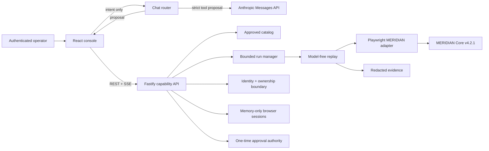

# MERIDIAN Capability Console

This project adapts a legacy, server-rendered MERIDIAN Core banking UI into a fast operator console backed by versioned, deterministic capabilities. Anthropic can interpret natural-language requests and propose one approved capability; it never receives credentials, approves a write, or controls replay. Once a user starts a run, the executor follows the reviewed artifact with no model in the decision loop.

The earlier synthetic Legacy UI Capability Engine remains in the repository as a regression harness and genuine-discovery evidence bundle. The current production-shaped path is the V2 catalog, API, session manager, MERIDIAN adapter, and React console described here.

## Delivered upgrade

Eight immutable V2 capabilities cover the required MERIDIAN surface:

| Capability | Effect | Result |
| --- | --- | --- |
| `session.sign_on` | Authentication | Creates a server-owned, memory-only browser session from an authorized credential profile. |
| `member.search_by_number` | Read | Returns matching member rows without guessing among duplicate `Select` links. |
| `member.search_by_last_name` | Read | Returns a structured list and preserves multiple-match semantics. |
| `member.get_record_and_balances` | Read | Returns member details plus typed share and money rows. |
| `funds.transfer` | Irreversible | Builds a transfer, stops at review, and requires a bound, expiring confirmation before one final post. |
| `share.open` | Irreversible | Reviews a new share and initial deposit before one confirmed final post. |
| `member.update_information` | Write | Reviews contact fields locally before a direct save. |
| `account.place_hold` | Supervisor-only | Requires both a supervisor console identity and supervisor MERIDIAN session before the run starts. |

All capabilities use exact origin and anchored route rules, exact-one semantic locators, typed inputs/outputs, explicit effects, declared runtime outcomes, and a final checkpoint. The catalog resolves only approved artifacts and binds every submission to the reviewed SHA-256 digest.

## Architecture



The important separation is deliberate:

- Anthropic is a replaceable chat/intent provider. It receives only redacted conversation text and strict, secret-free tool schemas.
- REST, SSE, capability contracts, sessions, and replay are provider-neutral application infrastructure.
- Replay is surface-neutral through `ReplayRuntimeV2`; Playwright is the current web implementation.
- Browser sessions, MERIDIAN credentials, anti-CSRF tokens, approval tokens, and operator identity are outside the model boundary.

These interfaces make future AI providers, native desktop adapters, queues, durable stores, identity systems, and policy engines additive rather than rewrites. See [REPORT.md](REPORT.md) for the extension seams and safety rationale.

## Guardrails

The console fails closed at each boundary:

- The server binds to loopback by default, sends a strict CSP and no CORS permission, requires a same-origin mutation header, and authenticates all non-health API routes.
- A console access code is exchanged once for an opaque `HttpOnly; SameSite=Strict` cookie. The built-in demo provider deliberately rejects access codes sent as reusable bearer credentials. Access-code attempts are rate-limited.
- The browser never receives MERIDIAN passwords, target cookies, CSRF tokens, approval tokens, or the opaque MERIDIAN session reference.
- Run and evidence endpoints are owner-scoped. A different authenticated operator receives `404`, not another user's data.
- Supervisor credentials cannot be selected by a teller identity. Supervisor-only capabilities require both console and target-session supervisor roles.
- Chat is proposal-only. It cannot sign on, launch hidden work, confirm a checkpoint, or claim success.
- Write submissions require an idempotency key. A key is bound to console subject, target session, capability, version, artifact digest, and input digest. Bindings are written to a fail-closed local ledger before work is queued, so normal run-history expiry or process restart cannot turn an old key into a new write.
- Approval requests contain the exact challenge ID and reviewed state nonce. The server compares both to the currently paused checkpoint, rechecks the review summary immediately before commit, and issues a short-lived, one-use HMAC token bound to run, artifact, inputs, session, step, actor, role, state, and summary.
- Sensitive review values are projected only after authorization. Success outputs are projected from declared output and table-column classifications; unknown fields and secret-shaped values are dropped or masked before JSON/SSE transport.
- Run history retains only submitted contract field names, not raw invocation values or input digests. The dashboard renders a protected input envelope while the runner drops its manager-side value copy immediately after construction. Sign-on credentials are hydrated only inside runner construction; its evidence uses an opaque session-bound audit digest rather than a password-derived verifier.
- Hidden transaction `_token` fields must exist, are used by native form submission, and are never copied into artifacts, APIs, logs, or screenshots.
- The executor never selects a result by DOM index. Table-row controls use a reviewed key column and must resolve exactly once.
- Final commits have no blind retry or recovery restart. If a write was attempted and its postcondition cannot prove the outcome, the run returns `EFFECT_UNKNOWN` instead of risking a duplicate transaction. A reversible write is still treated as externally uncertain until its postcondition succeeds.
- A pre-commit `440` session expiry requires a fresh sign-on and restart. A `403` is a supervisor escalation. A declared pre-commit `503` may take one policy-checked `Continue` recovery and restart. `500` is a hard failure before commit; `440`, `500`, or a transient marker observed after the one final commit attempt becomes `EFFECT_UNKNOWN` and requires reconciliation.

## Requirements

- Node.js `>=22.12 <27`
- npm
- Playwright Chromium
- Access to the configured MERIDIAN origin
- An Anthropic API key for natural-language routing, unless `CHAT_OFFLINE=1` explicitly selects deterministic development mode. Missing credentials otherwise fail startup.

Install dependencies and the browser:

```powershell
npm ci
npm run browser:install
```

The application reads process environment variables and does not automatically load `.env`. Copy values from [.env.example](.env.example) into your terminal or approved secret manager; never place real credentials in the repository.

At minimum, configure:

```powershell
$env:ANTHROPIC_API_KEY = "your-anthropic-key"
$env:MERIDIAN_CONSOLE_TELLER_ACCESS_CODE = "a-long-random-console-code"
$env:MERIDIAN_TELLER_PASSWORD = "server-side-meridian-password"
$env:APPROVAL_SIGNING_SECRET = "a-random-secret-of-at-least-32-bytes"
```

Supervisor access is independently configured with `MERIDIAN_CONSOLE_SUPERVISOR_ACCESS_CODE` and `MERIDIAN_SUPERVISOR_PASSWORD`. Use distinct random console codes. In HTTPS deployments set `CONSOLE_COOKIE_SECURE=1`; loopback HTTP development defaults to `0`.

## Run the console

For development, use two terminals:

```powershell
npm run dev:api
```

```powershell
npm run dev:web
```

Open `http://127.0.0.1:5173`. Vite proxies `/api` to `http://127.0.0.1:8787` by default; override only the development proxy with `VITE_API_ORIGIN`.

For a production-style same-origin build:

```powershell
npm run build
npm start
```

Open `http://127.0.0.1:8787`. The Fastify process serves the compiled React application and API from one origin.

The operator flow is:

1. Authenticate to the console with the role-specific access code.
2. Establish a teller or supervisor MERIDIAN session. The server resolves its configured credentials; the UI never asks for them.
3. Choose a capability or ask the Anthropic assistant for a proposal.
4. Review typed business inputs and start the deterministic run.
5. Follow queued, running, recovering, approval, and terminal states through SSE. Polling takes over if the stream disconnects.
6. For a write, review every API-authorized summary value and approve the exact current challenge. A missing or masked review value disables approval.
7. Use **Cancel safely** for queued or approval-paused work. Cancellation is owner-scoped, never substitutes for approval, and revokes a paused target session before the next operation.

For the supplied sample data, a safe reviewer walkthrough is:

1. Connect a teller session and run **Get member record and balances** for member `100234`. The terminal result should be `success`, with a contract-filtered share table and downloadable completion evidence.
2. Run the same capability for `999999`. The natural HTTP-200 search miss should terminate as the deliberate `MEMBER_NOT_FOUND` business outcome, with exceptional-state evidence—not as a retryable system failure.
3. Prepare a transfer to its review page. The run must stop at `awaiting_approval`; cancelling there demonstrates that chat, API retries, and the browser cannot cross the final post without the exact current human challenge. Approving will perform the real sample-system write, so do that only when the demonstration explicitly calls for it.
4. With a teller console/session, **Place account hold** remains unavailable before any browser step. Re-authenticate and reconnect as supervisor to exercise that capability; the server never swaps credentials underneath a teller-owned run.

The API contract is available at `/api/v1/openapi.json`. Mutating requests require `x-meridian-action: operator`; business writes also require `Idempotency-Key`. The console supplies both.

## Anthropic behavior

`ANTHROPIC_API_KEY` selects the official Anthropic Messages API router. `ANTHROPIC_CHAT_MODEL` is configurable and defaults to `claude-sonnet-5`. The intent-only call defaults to low effort through `ANTHROPIC_CHAT_EFFORT` and a 12-second provider deadline through `ANTHROPIC_CHAT_TIMEOUT_MS`; both are validated at startup. The browser allows a small transport grace beyond the server deadline. A caller disconnect, logout, or lifecycle teardown aborts the provider request, and one principal cannot leave two chat requests in flight.

Tool use is strict and parallel tool calls are disabled. Canonical Zod schemas remain the local source of truth. A provider-specific compiler uses Anthropic's supported-schema transformation, deliberately lowers unsupported value constraints such as regular-expression patterns into bounded guidance, and rejects unsupported structure or excessive grammar complexity before a network call. This prevents provider regex incompatibilities without weakening local email or explicit-pattern validation. Every returned argument object is revalidated locally against the original Zod contract, and one request can propose at most one capability.

Current messages containing credential material are rejected before a provider call. History and responses are redacted. Provider fallback occurs only for classified connectivity, timeout, rate-limit, `408`/`409`, or `5xx` outages; cancellation, ordinary provider `4xx` rejection, malformed output, unsafe arguments, and local validation failures do not silently fall back. Provider errors are mapped to fixed browser-safe codes and messages, while raw provider payloads, request bodies, tool-call IDs, and response IDs are neither returned nor logged. Set `CHAT_OFFLINE=1` to force deterministic local routing for tests.

Anthropic does not replace the API transport. This separation lets another provider or local model implement the `ChatRouter` interface without changing the UI, catalog, run manager, or replay engine.

## Runtime result model

Runs are asynchronous and expose stable meanings:

- `success`: the final checkpoint and every declared output were verified.
- `business_outcome`: a legitimate negative result such as `MEMBER_NOT_FOUND`, validation rejection, insufficient funds, a held source share, or an existing hold.
- `failure`: a technical or policy failure with a retryability and effect-certainty contract.
- `escalation`: a new authenticated session or a different role is required.

Natural search misses may arrive as HTTP `200` and are still business outcomes. Validation pages may use `400`. HTTP `403`, `404`, `440`, `500`, and `503` are classified from main-document responses only, never from unrelated subresources.

## Verification

Run the complete local gate:

```powershell
npm run check
```

Its components are:

```powershell
npm run typecheck
npm test
npm run build
```

The suite covers V1 regressions plus V2 artifact integrity, catalog immutability, member-page identity, row-scoped locators, main-document status tracking, typed tables/money, effect-aware retry, bounded `503` recovery, no-retry `403`/`440`/`500` handling, business outcomes, approval summary/state binding and expiry, session serialization, queue bounds, durable idempotency, Anthropic schema compatibility/tool validation/timeouts/fallback, API authentication/ownership, atomic evidence finalization, safe output projection, cancellation, and frontend lifecycle behavior.

A live read-only smoke test signs on and reads one synthetic member record with zero planner calls:

```powershell
$env:MERIDIAN_OPERATOR = "configured-operator"
$env:MERIDIAN_PASSWORD = "configured-password"
npm run smoke:meridian:read
```

The same read-only script can verify the natural exceptional path without changing target state:

```powershell
$env:MERIDIAN_MEMBER_NUMBER = "999999"
$env:MERIDIAN_EXPECTED_STATUS = "business_outcome"
npm run smoke:meridian:read
```

The read-only smoke was exercised successfully against the supplied target. Final transfer, share-open, member-update, and hold commits have intentionally not been executed against the shared live environment. Their reviewed forms, hidden token, role behavior, routes, HTTP outcomes, and final controls were characterized without posting the irreversible action.

This workspace did not have `ANTHROPIC_API_KEY` configured while the adaptation was built. The MERIDIAN V2 artifacts therefore truthfully declare `provenance.source: "authored"`; they were compiled from guarded live reconnaissance and local review and do not pretend to be a genuine Anthropic discovery run. The retained V1 bundle demonstrates the existing genuine discovery loop, and the V2 artifact contract already carries discovery run/provider/model provenance for promotion once an approved Anthropic key is supplied. A production promotion workflow should run that provider-backed discovery/review job, compare the canonical draft, execute read-only canaries, and only then publish a new approved digest.

## Evidence and privacy

Each live run creates a redacted evidence directory under `EVIDENCE_ROOT`. Events are append-only JSONL and are flushed and hashed before finalization. Terminal evidence may include a masked screenshot and sanitized DOM. The manifest is written atomically as the final completion marker and binds capability, artifact digest, input digest, terminal status, and incident codes while recording that planner calls were forbidden during replay. A run is not published terminal until its recorder and manifest have closed; temporary or hidden files are never listed as evidence. The dashboard stages downloads until the server reports a finalized manifest and distinguishes pending, failed, expired, and unavailable evidence instead of presenting a partial bundle.

Evidence endpoints require the owning console identity and safe path resolution; symlinks, traversal, hidden files, and atomic-write temporaries are rejected. Completed runs and their authorization metadata are retained for the configured run-retention window (eight hours by default); owner-scoped evidence is removed when its run is evicted. The local store is an adapter, not a compliance archive. A deployment should replace it with encrypted tenant-scoped object storage, retention and legal-hold policy, signed audit metadata, and institution-specific access review.

The local `evidence/ceo-rehearsal/` directory is intentionally ignored: it contains pre-hardening captures whose manifests predate the footer/member-hint masks. Do not present or publish it. Generate a fresh rehearsal bundle with this hardened build.

## Retained V1 harness

The original synthetic application, CLI discovery flow, model adapters, human-control coordinator, and checked evidence remain usable for regression and design comparison:

```powershell
npm run demo
npm run discover -- --planner offline --target "http://127.0.0.1:4317/?tenant=summit" --inputs "examples/inputs/discovery.json" --artifact "evidence/generated/offline-artifact.json" --evidence "evidence/generated/offline-discovery"
npm run replay -- --artifact "evidence/generated/offline-artifact.json" --target "http://127.0.0.1:4317/?tenant=harbor" --inputs "examples/inputs/replay.json" --evidence "evidence/generated/offline-replay"
```

The offline planner is a test double, not evidence of genuine LLM discovery. The checked V1 evidence bundle remains unchanged unless the explicit evidence replacement command is used.

The retained V1 operator handoff remains a same-live-session regression harness: automation releases exclusive control, a fragment-held console token authorizes the local operator surface, the human satisfies the pending postcondition, and deterministic execution resumes only after observing it. Raw session IDs and handoff tokens are absent from evidence; a one-way session correlation digest is retained for audit continuity. Generic V2 console handoff is not yet exposed; V2 role escalation instead requires a fresh correctly authorized session and a new run.

The project is available under the [MIT License](LICENSE).
