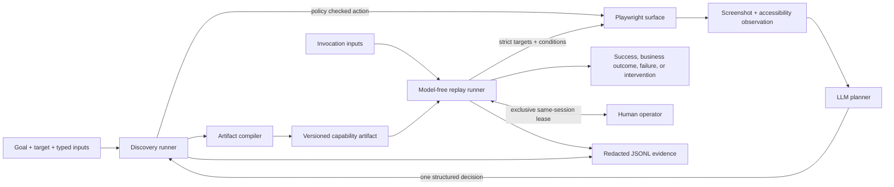

# Legacy UI Capability Engine

This repository is an end-to-end vertical slice of a record-once, replay-many computer-use system. During discovery, an LLM observes a live synthetic banking UI, chooses one safe action at a time, and produces a typed capability artifact. During replay, a separate executor validates that artifact and runs the declared steps deterministically with no model in the decision loop.

The demo deliberately resembles an unfriendly back-office application: server-rendered pages, nested iframe navigation, table layouts, generated element IDs, no test IDs, runtime interstitials, and two tenant layouts. It uses only synthetic records and stops on a review page; the final `Create sub-account` control is disabled and outside the capability boundary.

## What is implemented

- A bounded observe-decide-act discovery loop with screenshot plus compact accessibility observations and structured model decisions.
- Anthropic Messages API, OpenAI Responses API, and authenticated Codex CLI planner adapters, plus a clearly labeled offline test double.
- A strict, versioned Zod artifact contract with typed inputs, outputs, targets, steps, checkpoints, policy, business outcomes, recoveries, and exceptions.
- A model-free Playwright replay path with exact target cardinality, preconditions, postconditions, bounded retries, and structured results.
- Explicit handling for not found, a known interstitial, permission denial, session expiry, and transient loading.
- A same-session human handoff with exclusive epoch leases, a local operator surface, action evidence, and deterministic reconciliation on resume.
- Exact-origin navigation and resource egress controls, anchored route allowlists, action and risk policy, irreversible-action blocking, log redaction, masked screenshots, and sanitized DOM failure evidence.

## Architecture



The model boundary ends at the discovery journal. The compiler converts observed actions into reviewed, parameterized targets and steps; the raw transcript is not replayed. `src/replay/` has no model dependency. The schema and recorded conditions are the contract between discovery and execution.

Important implementation seams:

- `src/model/`: genuine and offline planner adapters that return the same validated decision type.
- `src/surface/`: observations and action receipts; `src/surface/playwright/` is the implemented web adapter and artifact runtime.
- `src/discovery/`: bounded agent loop and journal-to-artifact compiler.
- `src/domain/`: strict serialized contracts and cross-reference validation.
- `src/replay/`: deterministic execution and runtime-state taxonomy.
- `src/safety/`: navigation/action policy, risk classification, and redaction.
- `src/handoff/`: session ownership state machine and minimal operator surface.
- `src/evidence/`: append-only event recording and SHA-256 integrity metadata.
- `src/demo/`: local hostile legacy-bank stand-in; no external site or real customer data.

The short design rationale and explicit cut lines are in [REPORT.md](REPORT.md).
The implementation is available under the [MIT License](LICENSE).

## Prerequisites

- Node.js `>=22.12 <27` and npm. The repository pins the expected major line in `.nvmrc`.
- Chromium installed through Playwright.
- For genuine discovery, either:
  - an Anthropic API key with access to the configured Claude model;
  - an OpenAI API key with access to the configured model; or
  - an installed, authenticated Codex CLI and its absolute executable path.

No database, container, cloud account, bank credential, or third-party demo site is required.

## Setup

Windows PowerShell or Command Prompt:

```bat
npm.cmd ci
npm.cmd run browser:install
```

macOS/Linux:

```sh
npm ci
npm run browser:install
```

For Linux CI hosts, install the matching browser and OS packages with `npx playwright install --with-deps chromium`.

Configuration is read from environment variables. `.env.example` is a reference file; this application does not automatically load it.

| Variable | Required | Purpose |
| --- | --- | --- |
| `ANTHROPIC_API_KEY` | For `--planner anthropic` | Credential for the Anthropic Messages API. Never commit it. |
| `ANTHROPIC_MODEL` | No | Claude discovery model; defaults to `claude-sonnet-5`. |
| `ANTHROPIC_EFFORT` | No | `low`, `medium`, `high`, `xhigh`, or `max`; defaults to `medium`. |
| `ANTHROPIC_CALL_TIMEOUT_MS` | No | Per-decision timeout, from `1000` through `900000`; defaults to `120000`. |
| `OPENAI_API_KEY` | For `--planner openai` | Credential for the OpenAI Responses API. Never commit it. |
| `OPENAI_MODEL` | No | Discovery model; defaults to `gpt-5.6-terra`. |
| `CODEX_CLI_PATH` | For `--planner codex` | Absolute path to an authenticated Codex executable. |
| `CODEX_MODEL` | No | Codex discovery model; defaults to `gpt-5.6-terra`. |
| `CODEX_CALL_TIMEOUT_MS` | No | Per-decision Codex process timeout, from `1000` through `900000`; defaults to `120000`. |
| `PORT` or `DEMO_PORT` | No | Local demo port; defaults to `4317`. Use `0` for an ephemeral port when embedding the server. |
| `HOST` | No | Demo bind host; defaults to `127.0.0.1`. |

Set an Anthropic key only in the current terminal process. In **PowerShell**:

```powershell
$env:ANTHROPIC_API_KEY = "replace-with-your-key"
```

In **Command Prompt (`cmd.exe`)**:

```bat
set "ANTHROPIC_API_KEY=replace-with-your-key"
```

Do not put a real key in `.env.example`, the command line, Git, screenshots, or evidence. The application does not automatically load `.env`; either set the environment variable as above or use your own secret manager.

The Anthropic adapter uses the official TypeScript SDK, sends the masked PNG observation before the compact planner prompt, requests [schema-constrained structured output](https://platform.claude.com/docs/en/build-with-claude/structured-outputs), and then applies the same strict local Zod validation as every provider. Known invocation values and their URL-encoded forms are replaced by symbolic placeholders throughout the goal and compact observation; the model sees input names and primitive types, while the local runtime performs substitution. The adapter rejects refusals, truncated responses, unexpected stop reasons, malformed JSON, and semantically invalid decisions. `maxRetries` is zero so hidden SDK retries cannot exceed the bounded discovery contract; rerun failed discovery explicitly after investigating the recorded error. Anthropic is contacted only during discovery, never replay.

## Genuine discovery, then deterministic replay

Run these commands from the repository root. The commands in this section are intentionally identical in **Windows PowerShell** and **Windows Command Prompt**. They use `npm.cmd` and checked-in UTF-8 JSON files, avoiding the extra `cmd.exe` parsing pass that can strip quotes from inline JSON. On macOS/Linux, use the same commands with `npm` instead of `npm.cmd`.

**Terminal 1 - start the synthetic application**

```bat
npm.cmd run demo
```

It prints `Synthetic banking demo listening at http://127.0.0.1:4317` with the default configuration.

**Terminal 2 - run a genuine LLM discovery and save the artifact**

```bat
npm.cmd run discover -- --planner anthropic --target "http://127.0.0.1:4317/?tenant=summit" --inputs "examples/inputs/discovery.json" --artifact "evidence/generated/manual-artifact.json" --evidence "evidence/generated/manual-discovery" --headful
```

This uses the CLI's default five-output goal, 24-step limit, and 30-minute overall deadline; the deadline is intentionally large enough for a sequence of genuine multimodal model calls and remains bounded. Override it with `--timeout-ms` if needed. To use another genuine provider, replace `--planner anthropic` with `--planner openai` after setting `OPENAI_API_KEY`, or with `--planner codex` after configuring an authenticated `CODEX_CLI_PATH`. A successful discovery prints `"status": "success"`, writes the schema-validated artifact, and creates a unique run directory such as `evidence/generated/manual-discovery/discovery-<timestamp>-<id>/` containing `discovery.jsonl` and masked screenshots. Repeating discovery does not append to or overwrite an earlier run log.

**Terminal 2 - replay the artifact with new inputs and no model**

```bat
npm.cmd run replay -- --artifact "evidence/generated/manual-artifact.json" --target "http://127.0.0.1:4317/?tenant=harbor" --inputs "examples/inputs/replay.json" --evidence "evidence/generated/manual-replay" --headful
```

This deliberately replays the artifact on the reordered `harbor` tenant variant and with values different from discovery. Replay loads no planner, records `plannerCallCount: 0`, verifies every declared condition, and returns only after the final checkpoint and outputs are present.

Inspect the agent-facing contract without executing it:

```bat
npm.cmd run inspect -- --artifact "evidence/generated/manual-artifact.json"
```

### Input options and Windows quoting

`--inputs <value>` accepts either a JSON object or a UTF-8 JSON file path. Files are the safest option across shells and support string, number, and boolean values. For simple string inputs, the repeatable form below is also identical in PowerShell and Command Prompt:

```bat
npm.cmd run replay -- --artifact "evidence/generated/manual-artifact.json" --target "http://127.0.0.1:4317/?tenant=harbor" --input "memberId=MBR-1002" --input "accountType=Money market" --input "nickname=Future Fund" --input "initialDeposit=725.50" --evidence "evidence/generated/repeatable-input-replay"
```

Do not copy POSIX-style single-quoted inline JSON into Windows `npm run` commands. PowerShell parses it once and npm then routes the script through `cmd.exe`, which can remove the JSON's double quotes. Inline JSON remains supported for shells that preserve it, but the checked-in files and repeatable `--input` form avoid that ambiguity.

## Run without live model services

The local application, offline planner, compiler, replay engine, policy, handoff, and evidence layers can be exercised without an API key or network service:

```bat
npm.cmd run discover -- --planner offline --target "http://127.0.0.1:4317/?tenant=summit" --inputs "examples/inputs/discovery.json" --artifact "evidence/generated/offline-artifact.json" --evidence "evidence/generated/offline-discovery"
npm.cmd run replay -- --artifact "evidence/generated/offline-artifact.json" --target "http://127.0.0.1:4317/?tenant=harbor" --inputs "examples/inputs/replay.json" --evidence "evidence/generated/offline-replay"
```

`--planner offline` is a deterministic test double, not evidence of genuine LLM discovery. It exists for reviewer reproducibility and automated tests; submission evidence must come from `anthropic`, `openai`, or `codex`.

Replay requires the artifact produced by a successful discovery. If replay reports `ENOENT` for the artifact, scroll back to discovery: it did not finish and therefore correctly saved nothing. Fix the discovery error, confirm it prints `"status": "success"`, and only then run replay.

## Exercise runtime outcomes and recovery

Reuse the saved artifact and change only `memberId`:

| Synthetic input | Expected replay contract |
| --- | --- |
| `MISSING-0000` | `business_outcome` with `MEMBER_NOT_FOUND`. |
| `NOTICE-1001` | Dismiss the declared training notice once, then continue. |
| `DENIED-1001` | Hard `failure` with `PERMISSION_DENIED`, a masked screenshot, and a redacted DOM snapshot. |
| `HANDOFF-1001` | Pause for same-session human intervention. |
| `SLOW-1001` | Wait for the declared busy state to settle, then continue. |

For the real manual handoff path, run replay with `HANDOFF-1001` and `--headful`, without `--auto-handoff-demo`. Replay prints a local operator URL. Open it, take exclusive control, restore the training session, and hand control back. The controlled `BrowserContext` and page are preserved, ownership changes are epoch-checked, and the human action is recorded before replay reconciles the pending step. Discovery uses the same coordinator for one bounded handoff when the model escalates, policy denies its proposed action, or three actions leave the observable state unchanged.

For a non-interactive regression demonstration of the same control-transfer mechanism, add `--auto-handoff-demo`. That option drives the mock operator endpoints and is not presented as a human usability test.

## Evidence

Discovery and replay logs are newline-delimited, append-only event streams with sequence numbers, timestamps, run IDs, actor identity, reasons, policy decisions, target-resolution attempts, checkpoints, and terminal status. Failure evidence includes SHA-256 metadata for masked screenshots and sanitized DOM snapshots. Invocation values are registered with the redactor before events are written.

`evidence/index.json` is the machine-readable map of provenance, artifact digest, run IDs, outcomes, logs, manifests, and attached evidence. Evidence generation replaces the checked-in artifact, discovery directory, replay runs, and index; preserve the submitted bundle before regenerating it. The generator requires `--replace-checked-evidence`, constructs the selected provider (so a missing API key fails), and binds its demo port before deleting those paths.

With an Anthropic key, run this in PowerShell or Command Prompt:

```bat
npm.cmd run evidence -- --provider anthropic --replace-checked-evidence
```

For OpenAI, use `--provider openai`; for an authenticated Codex CLI, use `--provider codex`. On macOS/Linux, replace `npm.cmd` with `npm`.

```bat
npm.cmd run evidence -- --provider openai --replace-checked-evidence
npm.cmd run evidence -- --provider codex --replace-checked-evidence
```

The evidence generator starts and stops its own local demo on port `4317`; stop a separately running `npm.cmd run demo` first, or add `--port 4329` to use another free port. Do not run it merely to check the repository: it intentionally replaces the reviewed bundle, and submission verification requires genuine-model provenance. Use `npm.cmd test` or `npm.cmd run test:e2e` for the network-free ScriptedPlanner path instead. On macOS/Linux, omit `.cmd`.

The checked-in [evidence index](evidence/index.json) was generated on `2026-08-14T00:56:45.520Z` and passed the bundle verifier. Treat the checked `evidence/` bundle as immutable except when intentionally replacing all of it with the full generator; routine reviewer runs belong under ignored `evidence/generated/`.

- Genuine discovery run `discovery-codex` used provider `openai-codex-cli`, model `gpt-5.6-terra`, and 13 planner calls against `http://127.0.0.1:4317/?tenant=summit`. Its [redacted event log](evidence/discovery/events.jsonl) is accompanied by 25 masked observations.
- The saved [capability artifact](evidence/artifact.json) has SHA-256 `f53a7746e58e366f0a6e1a4551c6f296d1d4ea61f8346812adb35774efe9eccd` and points back to that discovery run.
- `success-harbor` replayed with different inputs on the reordered tenant and returned success; see its [event log](evidence/runs/success-harbor/events.jsonl).
- `member-not-found` returned the typed `MEMBER_NOT_FOUND` business outcome, while `training-notice` recovered and completed within its declared bound.
- `permission-denied` failed with `PERMISSION_DENIED` and captured a [masked screenshot](evidence/runs/permission-denied/screenshots/failure-permission_denied.png) plus [redacted DOM](evidence/runs/permission-denied/dom/failure-permission_denied.html).
- `same-session-handoff` transferred control, recorded the operator action, resumed, and completed; see its [event log](evidence/runs/same-session-handoff/events.jsonl).

Every replay index entry reports `plannerCallsAllowed: false`, `plannerCallCount: 0`, and `modelDecisionEventCount: 0`.

## Tests and verification

Run the complete local quality gate:

```bat
npm.cmd run check
```

Or run its components independently:

```bat
npm.cmd run typecheck
npm.cmd test
npm.cmd run build
```

The suite covers artifact graph integrity, malformed patterns, policy bypass attempts, recursive redaction, append-only evidence, live UI discovery, parameterized cross-tenant replay, typed not-found outcomes, bounded notice recovery, permission-denied evidence, and exclusive same-session handoff. The e2e suite starts the demo on an ephemeral local port and uses only synthetic data.

The checked-in GitHub Actions workflow installs the Playwright-managed Chromium build and runs the same `npm run check` gate on Linux.

## Security model and limitations

- Policy is enforced immediately before actions and on direct navigation, frames, redirects, and popups. Every HTTP(S) asset/fetch request and WebSocket is separately exact-origin checked, service workers are disabled, and downloads are canceled. Anchored document routes avoid substring and path-prefix bypasses while same-origin resources may use sibling asset paths.
- Replay blocks artifact steps marked irreversible. The implemented capability intentionally stops before creation; a production write capability would require an authenticated, expiring approval token bound to the artifact digest, step, inputs digest, tenant, and operator.
- Exact role/name, label, semantic `name`, and exact text strategies are attempted in reviewed order. Every strategy must resolve to exactly one element; ambiguity fails closed. Generated IDs, coordinates, and ordinal selectors are not recorded.
- Logs redact registered caller values, sensitive keys, and common secret/token forms. Screenshots mask form values and elements marked sensitive; DOM evidence strips live values. Artifacts store input references, not invocation values.
- These controls reduce accidental disclosure; they are not a substitute for encryption, retention policy, access control, audit signing, or a regulated data-loss-prevention program. A production deployment would keep evidence in an encrypted tenant-scoped store with retention and legal-hold controls.
- During genuine discovery, the selected model provider receives the symbolized goal, input names/types, masked screenshot, and compact accessibility observation. Known invocation values are symbolized in observation text, control values, and URLs before the request. This demo contains only synthetic data. Masking and exact-value substitution reduce accidental disclosure but are not general DLP; a real financial deployment would require an approved provider boundary, stronger data classification, regional controls, and institution-specific authorization.
- The local operator page is deliberately narrow and unauthenticated because it binds to loopback. A deployed console needs strong operator authentication, authorization, CSRF protection, secure transport, and signed intervention leases.

## Decisions worth defending

- **Compile a capability, not a transcript.** The model may be nondeterministic during discovery; replay consumes only strict, reviewable data.
- **Parameterize at capture time.** Planner actions identify caller inputs symbolically, and persistence rejects artifacts containing concrete discovery values.
- **Prefer semantic uniqueness over selector cleverness.** Exact accessible identity and fail-closed cardinality survive generated IDs and tenant layout changes without silently choosing the wrong control.
- **Treat runtime states as contract data.** A not-found result, a recovery, a hard failure, and an intervention are different caller-visible meanings.
- **Keep one owner of the live session.** Epoch leases make automation and human control mutually exclusive and make stale actions detectable.
- **Stop before the irreversible boundary.** The useful review capability is fully testable without pretending that a prompt warning is sufficient authorization for a financial write.
